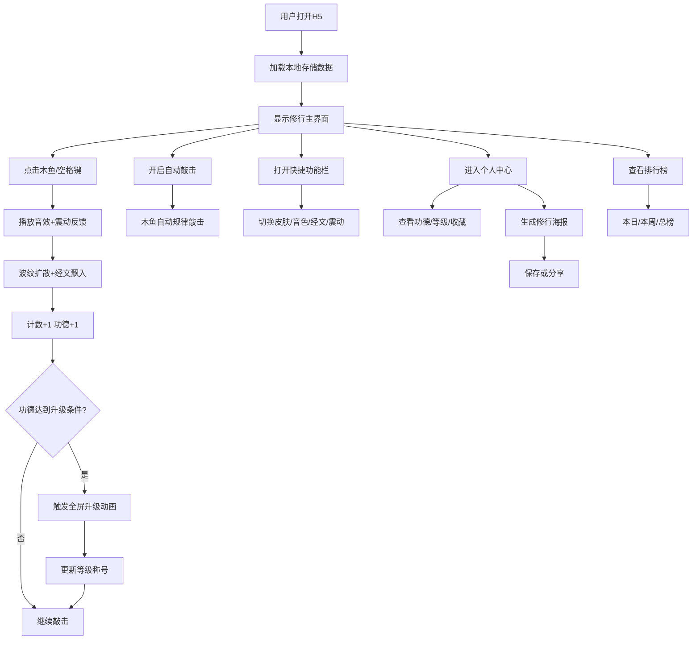

## 1. 产品概述

一款融合赛博朋克美学与传统修行元素的H5网页工具，用户通过点击/敲击屏幕模拟敲木鱼，积累赛博功德值。内置多种电子音色、霓虹灯光效与动态经文，支持敲击计数、自动敲击、成就解锁与排行榜比拼。

- 核心目标：让现代人在数字世界找到片刻宁静，或与好友进行轻松搞怪的"功德竞赛"
- 目标用户：程序员、职场白领、年轻网生代、喜欢猎奇与社交分享的用户群体
- 市场价值：结合传统文化与赛博朋克亚文化，创造具有强社交传播属性的轻量娱乐工具

## 2. 核心功能

### 2.1 用户角色

| 角色 | 注册方式 | 核心权限 |
|------|----------|----------|
| 游客用户 | 无需注册，自动生成赛博法号 | 使用所有核心功能，数据本地存储 |
| 登录用户 | 分享/排行榜功能自动关联 | 参与全网排行榜，数据云端同步（可选） |

### 2.2 功能模块

1. **修行主界面**：木鱼敲击、计数显示、功德值、等级进度、动态背景粒子
2. **快捷功能栏**：皮肤切换、音色切换、经文开关、震动开关、自动敲击
3. **赛博功德体系**：等级系统、升级动画、每日上限
4. **经文系统**：随机赛博经文飘入、自定义经文清单
5. **皮肤系统**：多款木鱼外观、解锁条件、专属光效
6. **排行榜与社交**：功德榜、好友PK、修行海报生成
7. **个人中心**：赛博法号、累计功德、皮肤收藏、设置、数据导出/重置

### 2.3 页面详情

| 页面名称 | 模块名称 | 功能描述 |
|----------|----------|----------|
| 修行主界面 | 木鱼交互区 | 点击/触摸/空格键敲击，长按连续敲击，波纹扩散动画 |
| 修行主界面 | 计数字板 | 实时显示敲击次数、功德值、修行等级称号、升级进度条 |
| 修行主界面 | 动态背景 | 星空粒子、霓虹渐变、经文粒子漂浮 |
| 修行主界面 | 自动敲击按钮 | 放置模式开关，显示"赛博修行中..."状态 |
| 快捷功能栏 | 皮肤面板 | 展示所有皮肤、解锁条件、预览切换 |
| 快捷功能栏 | 音色选择 | 电子音/木鱼原声/合成器音/鼓点音切换 |
| 快捷功能栏 | 经文设置 | 显示开关、频率、透明度调节 |
| 快捷功能栏 | 震动开关 | 触觉反馈开关（支持设备） |
| 功德体系 | 等级系统 | 赛博小沙弥→代码比丘→算法罗汉→数据菩萨→全栈佛 |
| 功德体系 | 升级动画 | 全屏霓虹光芒汇聚，等级称号弹出特效 |
| 经文系统 | 经文飘入 | 敲击时从屏幕边缘随机飘入赛博经文 |
| 皮肤系统 | 皮肤列表 | 原初木鱼、霓虹灯管、透明水晶、故障像素、黄金电路板、暗黑猫猫 |
| 排行榜 | 全网榜单 | 本日榜/本周榜/总榜，显示排名、头像、昵称、功德值 |
| 社交 | 修行海报 | 生成赛博风格海报，含功德值、等级、座右铭，支持保存分享 |
| 个人中心 | 用户信息 | 赛博法号、头像、累计功德、等级进度 |
| 个人中心 | 收藏与成就 | 皮肤收藏列表、成就徽章展示 |
| 个人中心 | 设置 | 音效音量、震动、背景音乐、经文偏好、隐私设置 |
| 个人中心 | 数据管理 | 数据导出、数据重置 |

## 3. 核心流程

用户打开网页 → 自动生成赛博法号并加载本地数据 → 显示主界面（木鱼+计数+背景）→ 用户点击木鱼/按空格 → 触发音效+震动+波纹+飘经+计数+功德 → 功德累计升级触发动画 → 可开启自动敲击放置模式 → 通过快捷栏切换皮肤/音色/设置 → 进入个人中心查看数据或生成海报分享 → 查看排行榜与他人PK

## 4. 用户界面设计

### 4.1 设计风格

- **主色调**：深邃黑 (#0a0a0f) 为底，霓虹紫 (#a855f7)、霓虹青 (#22d3ee)、霓虹粉 (#ec4899) 三色交替点缀
- **辅助色**：故障绿 (#00ff88)、警告红 (#ff3366)、数据金 (#ffd700)
- **按钮风格**：霓虹发光边框，圆角8px，hover时外发光脉冲，点击时内缩
- **字体**：
  - 标题/数字：Orbitron（赛博朋克风格）或局部使用像素字体
  - 正文/经文：ZCOOL QingKe HuangYou 或 Noto Sans SC
  - 故障效果文字：使用 text-shadow 多层偏移模拟 glitch
- **布局风格**：沉浸式全屏布局，中央为木鱼核心区，底部快捷栏悬浮，四周留白给粒子/经文
- **视觉效果**：
  - 故障艺术（Glitch）：数字变化、等级提升时触发
  - 霓虹辉光：重要元素使用 text-shadow 和 box-shadow 模拟发光
  - 扫描线：半透明水平扫描线覆盖全屏
  - 噪点纹理：细微的胶片颗粒感叠加
- **图标风格**：线性霓虹描边图标，发光效果

### 4.2 页面设计概述

| 页面名称 | 模块名称 | UI元素 |
|----------|----------|--------|
| 修行主界面 | 木鱼交互区 | 3D感木鱼居中，霓虹描边，点击时scale缩放+涟漪波纹从中心扩散，鼠标指针变为光标手指 |
| 修行主界面 | 计数字板 | 顶部居中，大号Orbitron字体显示敲击数，下方较小字体显示功德值，左侧等级称号带发光标签，右侧进度条 |
| 修行主界面 | 动态背景 | Canvas粒子星空，缓慢漂移，敲击时粒子迸发；径向渐变从中心紫色向边缘黑色过渡 |
| 修行主界面 | 自动敲击按钮 | 底部偏左，赛博绿发光按钮，"自动敲击"文字，开启后变为"赛博修行中..."带呼吸动画 |
| 快捷功能栏 | 底部工具栏 | 半透明深色面板，四个功能按钮（皮肤/音色/经文/震动）横向排列，图标+文字，点击展开对应面板 |
| 快捷功能栏 | 皮肤面板 | 从底部上滑的模态面板，网格布局展示皮肤卡片，显示预览、名称、解锁条件，已解锁可点击切换，未解锁显示锁定 |
| 功德体系 | 升级动画 | 全屏遮罩，霓虹光芒从四周向中心汇聚，中心爆炸闪光后弹出新等级称号，Glitch效果文字，3秒后自动消失 |
| 经文系统 | 经文飘入 | 从随机边缘飘入，半透明霓虹色，缓慢漂移后淡出，敲击频率决定经文密度 |
| 排行榜 | 榜单页面 | 顶部Tab切换（本日/本周/总榜），列表项含排名数字（前三名带霓虹色奖牌图标）、头像、昵称、功德值，发光分隔线 |
| 社交 | 修行海报 | 竖向赛博风格海报，顶部"赛博修行证书"标题，中部大号功德数字和等级，底部座右铭+赛博法号，二维码区域，霓虹边框装饰 |
| 个人中心 | 用户信息区 | 头像（赛博风格生成）+赛博法号+等级标签+累计功德+进度条 |
| 个人中心 | 设置列表 | 分组设置项，开关组件、滑块组件、选择器，赛博风格 |

### 4.3 响应式

- **移动端优先**：默认竖屏布局，木鱼占屏幕宽度60%，触摸区域放大
- **横屏适配**：木鱼居左，计数面板居右，双栏布局
- **PC端适配**：支持键盘空格键敲击，鼠标点击，完整键盘快捷键（S=皮肤、T=音色、A=自动敲击）
- **触摸优化**：所有交互区域≥44px，防止误触，按钮添加触摸反馈

### 4.4 视觉特效指引

- **木鱼敲击波纹**：Canvas绘制，多层同心圆从中心向外扩散，逐渐透明消失，颜色随皮肤变化
- **粒子系统**：背景常驻星空粒子（低数量），敲击时迸发10-20个粒子向四周飞散，颜色随机霓虹色
- **升级特效**：CSS动画+Canvas粒子爆发，中心径向渐变光脉冲，文字Glitch抖动
- **经文飘入动画**：CSS transform + opacity，从屏幕外飘入，随机轨迹，停留2-3秒后淡出
- **按钮发光**：box-shadow 多层霓虹色阴影，hover时添加 pulse 动画
- **数字滚动**：敲击时数字从0-9快速滚动后停在目标值，期间有轻微Glitch效果
