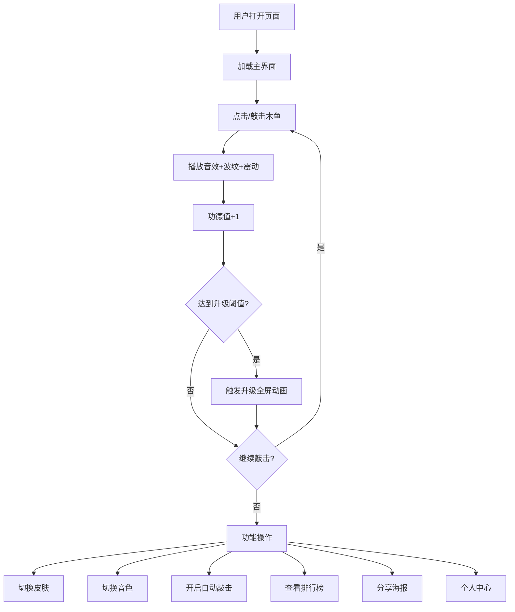

## 1. 产品概述

赛博木鱼是一款融合赛博朋克美学与传统修行元素的H5网页工具，用户通过点击/敲击屏幕模拟敲木鱼，积累赛博功德值，在数字世界找到片刻宁静，或与好友进行轻松搞怪的"功德竞赛"。

- 目标用户：互联网从业者、程序员、追求减压与趣味体验的年轻用户
- 核心价值：将传统修行仪式数字化，以赛博朋克风格打造沉浸式减压体验与社交互动

## 2. 核心功能

### 2.1 用户角色

| 角色 | 注册方式 | 核心权限 |
|------|----------|----------|
| 游客 | 无需注册 | 敲击木鱼、查看功德值、切换皮肤与音色（本地数据） |
| 注册用户 | 昵称+随机赛博法号 | 参与排行榜、好友PK、分享修行海报、自定义经文 |

### 2.2 功能模块

1. **修行主界面**：木鱼敲击、波纹特效、功德计数、自动敲击
2. **功德体系**：功德值积累、修行等级、升级动画
3. **经文系统**：浮动赛博经文、自定义经文、频率控制
4. **皮肤系统**：多款木鱼外观、解锁条件、专属光效
5. **排行榜与社交**：功德榜、好友PK、修行海报、敲击合奏
6. **个人中心**：用户信息、功德总览、成就徽章、设置

### 2.3 页面详情

| 页面名称 | 模块名称 | 功能描述 |
|----------|----------|----------|
| 修行主界面 | 木鱼本体 | 中央3D渲染木鱼，带霓虹描边，点击/空格键触发敲击，产生波纹、音效与震动反馈 |
| 修行主界面 | 功德计数器 | 木鱼下方实时显示敲击次数与功德值，数值滚动变化效果 |
| 修行主界面 | 浮动经文 | 敲击时随机从屏幕边缘飘入赛博经文粒子 |
| 修行主界面 | 快捷功能栏 | 底部切换皮肤、音色、经文开关、震动开关、自动敲击按钮 |
| 功德体系 | 修行等级 | 5级修行等级体系，升级触发全屏霓虹动画 |
| 功德体系 | 每日上限 | 免费用户每日1000功德上限，可突破 |
| 经文系统 | 经文展示 | 预设赛博经文列表，随机飘入展示 |
| 经文系统 | 自定义经文 | 用户可添加/编辑个人经文清单 |
| 皮肤系统 | 皮肤选择面板 | 弹出面板展示6款木鱼皮肤，显示解锁条件与状态 |
| 皮肤系统 | 皮肤预览 | 切换时预览动画，专属光效 |
| 排行榜 | 赛博功德榜 | 本日/本周/总榜，显示排名、头像、昵称、功德值 |
| 排行榜 | 好友PK | 生成邀请链接，双方功德实时对比 |
| 排行榜 | 修行海报 | 生成赛博风格海报，包含功德值、等级、座右铭 |
| 个人中心 | 用户信息 | 赛博法号、头像设置 |
| 个人中心 | 功德总览 | 累计功德、等级进度条、皮肤收藏、成就徽章 |
| 个人中心 | 设置面板 | 音效/震动/背景音乐/经文偏好/隐私/数据管理 |

## 3. 核心流程

用户打开页面 → 看到中央木鱼与星空背景 → 点击/敲击木鱼 → 产生波纹+音效+震动 → 功德+1 → 经文飘入 → 功德值累计 → 达到阈值触发升级动画 → 可开启自动敲击 → 可切换皮肤/音色 → 可查看排行榜 → 可分享修行海报

## 4. 用户界面设计

### 4.1 设计风格

- 主色调：霓虹紫(#A855F7)、赛博青(#06F9D0)、霓虹粉(#FF2E97)
- 辅助色：暗黑底(#0A0A1A)、深紫(#1A0A2E)、电光蓝(#00D4FF)
- 按钮风格：圆角矩形，霓虹发光边框，hover时光晕扩散
- 字体：标题使用赛博朋克风格像素字体/故障艺术字体，正文使用现代无衬线体
- 布局：中央聚焦式，木鱼占据主视觉区域，功能按钮环绕分布
- 图标：线性霓虹风格图标，带发光效果
- 动效：波纹扩散、故障闪烁、粒子飘动、数字滚动

### 4.2 页面设计概览

| 页面名称 | 模块名称 | UI元素 |
|----------|----------|--------|
| 修行主界面 | 木鱼本体 | 深色星空背景，中央木鱼带霓虹描边，敲击放大缩小动画，径向波纹扩散 |
| 修行主界面 | 功德计数器 | 大号霓虹数字，滚动变化效果，增长时高亮闪烁，修行等级标签 |
| 修行主界面 | 浮动经文 | 半透明霓虹色文字，从边缘飘入，淡出消失 |
| 修行主界面 | 快捷功能栏 | 底部半透明玻璃态工具栏，圆形图标按钮，自动敲击带脉冲动画 |
| 功德体系 | 升级动画 | 全屏霓虹光芒汇聚，等级称号大字弹出，粒子爆发 |
| 皮肤系统 | 皮肤面板 | 底部弹出抽屉，网格展示皮肤缩略图，锁定皮肤灰度+锁图标 |
| 排行榜 | 排行榜页面 | 暗色表格，前三名金银铜高亮，霓虹分割线，tab切换日/周/总 |
| 个人中心 | 个人页面 | 卡片式布局，进度条霓虹渐变，徽章网格展示 |

### 4.3 响应式适配

- 移动端优先设计，竖屏为主
- 木鱼敲击区域占屏幕60%以上，确保触摸友好
- PC端居中显示，支持空格键敲击
- 横屏模式自动调整布局
- 低端设备降级为静态背景，关闭粒子效果

### 4.4 3D场景指导

- 木鱼使用Canvas 2D渲染（非WebGL），确保兼容性
- 木鱼绘制：圆形/椭圆形主体+纹理线条，霓虹描边glow效果
- 不同皮肤通过颜色方案和装饰图案区分
- 波纹效果：多层同心圆扩散，透明度渐变
- 粒子效果：轻量级Canvas粒子，星空背景点阵
