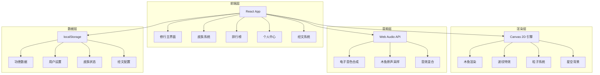
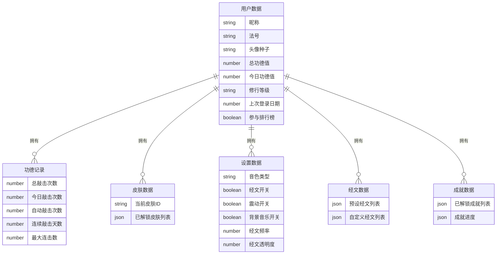

## 1. 架构设计



## 2. 技术说明

- 前端：React@18 + TailwindCSS@3 + Vite
- 初始化工具：Vite
- 后端：无（纯前端H5应用，数据存储在localStorage）
- 数据库：localStorage + 内存状态管理
- 音频：Web Audio API（纯前端合成，无需后端）
- 渲染：Canvas 2D API（木鱼、波纹、粒子）
- 分享：html2canvas生成海报 + Web Share API

## 3. 路由定义

| 路由 | 用途 |
|------|------|
| / | 修行主界面（木鱼敲击、功德计数） |
| /skins | 皮肤选择面板（底部弹出抽屉） |
| /leaderboard | 赛博功德排行榜 |
| /profile | 个人中心（设置、成就、功德总览） |

## 4. 数据模型

### 4.1 数据模型定义



### 4.2 localStorage数据结构

```typescript
interface UserData {
  nickname: string
  dharmaName: string
  avatarSeed: string
  totalMerit: number
  todayMerit: number
  level: string
  lastLoginDate: string
  showOnLeaderboard: boolean
}

interface MeritRecord {
  totalKnocks: number
  todayKnocks: number
  autoKnockCount: number
  streakDays: number
  maxCombo: number
}

interface SkinData {
  currentSkinId: string
  unlockedSkins: string[]
}

interface SettingsData {
  soundType: 'electronic' | 'wooden' | 'synth' | 'drum'
  sutraEnabled: boolean
  vibrationEnabled: boolean
  bgmEnabled: boolean
  sutraFrequency: number
  sutraOpacity: number
}

interface SutraData {
  presetSutras: string[]
  customSutras: string[]
}

interface AchievementData {
  unlocked: string[]
  progress: Record<string, number>
}
```

## 5. 核心模块设计

### 5.1 木鱼渲染模块

- 使用Canvas 2D绘制木鱼形状（椭圆形主体+装饰线条+底座）
- 霓虹描边通过shadowBlur + shadowColor实现glow效果
- 不同皮肤通过颜色方案和装饰元素切换
- 敲击动画：scale缩放 + 弹性回弹（CSS transition或requestAnimationFrame）

### 5.2 音效合成模块

- 使用Web Audio API的OscillatorNode生成电子音色
- 木鱼原声使用AudioBuffer存储采样
- 合成器音使用多个振荡器叠加
- 鼓点音使用噪声+滤波器
- 所有音效通过GainNode控制音量，避免爆音

### 5.3 粒子系统模块

- 星空背景：随机分布的点阵，缓慢闪烁
- 经文粒子：从屏幕边缘飘入，透明度渐变后消失
- 升级粒子：从中心爆发，向四周扩散
- 性能优化：限制同时活跃粒子数量，低端设备自动降级

### 5.4 功德计算模块

- 手动敲击：功德+1
- 自动敲击：功德+0.5（取整）
- 每日上限检查：1000功德/天（免费用户）
- 等级判定：根据总功德值匹配等级阈值

### 5.5 数据持久化模块

- 所有数据存储在localStorage
- 每次状态变更自动同步
- 页面加载时从localStorage恢复
- 支持数据导出（JSON格式）和重置
