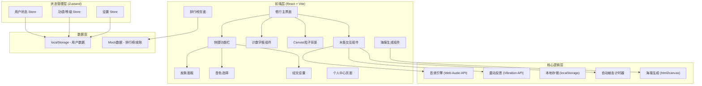

## 1. 架构设计



## 2. 技术选型

- **前端框架**：React@18 + TypeScript
- **构建工具**：Vite@5
- **样式方案**：TailwindCSS@3 + PostCSS
- **状态管理**：Zustand（轻量级，适合小型应用）
- **路由**：React Router DOM@6
- **图标**：Lucide React（霓虹风格线性图标）
- **海报生成**：html2canvas
- **动画**：CSS Keyframes + Framer Motion（复杂动画）
- **音效**：Web Audio API（合成音效，无需音频文件）
- **粒子/波纹**：Canvas API

## 3. 目录结构

```
f:\repo\repo6/
├── src/
│   ├── components/          # 组件目录
│   │   ├── WoodenFish/      # 木鱼组件
│   │   │   ├── WoodenFish.tsx
│   │   │   ├── FishSkin.tsx # 皮肤渲染
│   │   │   └── Ripple.tsx   # 波纹效果
│   │   ├── Counter/         # 计数面板
│   │   │   ├── CounterBoard.tsx
│   │   │   └── LevelProgress.tsx
│   │   ├── Background/      # 背景
│   │   │   ├── ParticleCanvas.tsx
│   │   │   └── ScanLines.tsx
│   │   ├── Scripture/       # 经文
│   │   │   └── FloatingScripture.tsx
│   │   ├── Toolbar/         # 工具栏
│   │   │   ├── QuickToolbar.tsx
│   │   │   ├── SkinPanel.tsx
│   │   │   └── SettingsPanel.tsx
│   │   ├── Common/          # 通用组件
│   │   │   ├── NeonButton.tsx
│   │   │   ├── GlitchText.tsx
│   │   │   └── Modal.tsx
│   │   ├── LevelUp/         # 升级动画
│   │   │   └── LevelUpEffect.tsx
│   │   ├── Profile/         # 个人中心
│   │   │   └── ProfilePage.tsx
│   │   ├── Leaderboard/     # 排行榜
│   │   │   └── LeaderboardPage.tsx
│   │   └── Poster/          # 海报
│   │       ├── PosterTemplate.tsx
│   │       └── PosterGenerator.tsx
│   ├── store/               # Zustand stores
│   │   ├── useUserStore.ts
│   │   ├── useGameStore.ts
│   │   └── useSettingsStore.ts
│   ├── hooks/               # 自定义hooks
│   │   ├── useAudio.ts
│   │   ├── useVibration.ts
│   │   ├── useAutoKnock.ts
│   │   └── useLocalStorage.ts
│   ├── data/                # 数据/常量
│   │   ├── skins.ts
│   │   ├── scriptures.ts
│   │   ├── levels.ts
│   │   ├── sounds.ts
│   │   └── mockLeaderboard.ts
│   ├── utils/               # 工具函数
│   │   ├── storage.ts
│   │   ├── generateName.ts
│   │   └── formatNumber.ts
│   ├── types/               # TypeScript类型
│   │   └── index.ts
│   ├── styles/              # 全局样式
│   │   ├── globals.css
│   │   └── animations.css
│   ├── pages/               # 页面
│   │   ├── HomePage.tsx
│   │   ├── ProfilePage.tsx
│   │   └── LeaderboardPage.tsx
│   ├── App.tsx
│   ├── main.tsx
│   └── vite-env.d.ts
├── public/
│   └── favicon.svg
├── index.html
├── package.json
├── vite.config.ts
├── tsconfig.json
├── tailwind.config.js
└── postcss.config.js
```

## 4. 路由定义

| 路由 | 页面组件 | 用途 |
|------|----------|------|
| / | HomePage | 修行主界面（木鱼+计数+工具栏） |
| /profile | ProfilePage | 个人中心（设置、数据管理、收藏） |
| /leaderboard | LeaderboardPage | 赛博功德榜（本日/本周/总榜） |

## 5. 核心数据模型

### 5.1 TypeScript 类型定义

```typescript
// 用户数据
interface UserData {
  id: string;                    // 唯一ID
  cyberName: string;             // 赛博法号
  avatarSeed: number;            // 头像生成种子
  totalKnocks: number;           // 累计敲击次数
  totalMerit: number;            // 累计功德值
  todayMerit: number;            // 今日功德值
  todayDate: string;             // 今日日期(YYYY-MM-DD)
  level: number;                 // 当前等级索引
  unlockedSkins: string[];       // 已解锁皮肤ID
  currentSkin: string;           // 当前皮肤ID
  achievements: string[];        // 已解锁成就
  createdAt: number;             // 创建时间戳
}

// 设置
interface Settings {
  soundEnabled: boolean;         // 音效开关
  soundVolume: number;           // 音效音量 0-1
  soundType: SoundType;          // 音色类型
  vibrationEnabled: boolean;     // 震动开关
  scriptureEnabled: boolean;     // 经文开关
  scriptureFrequency: number;    // 经文频率 1-5
  scriptureOpacity: number;      // 经文透明度 0.1-1
  autoKnockEnabled: boolean;     // 自动敲击
  autoKnockSpeed: number;        // 自动敲击速度(ms)
  bgmEnabled: boolean;           // 背景音乐
  participateInRanking: boolean; // 参与排行榜
}

// 皮肤
interface Skin {
  id: string;
  name: string;
  description: string;
  unlockCondition: {
    type: 'merit' | 'share' | 'event';
    value: number | string;
  };
  colors: {
    primary: string;
    secondary: string;
    glow: string;
  };
  pattern?: 'wood' | 'neon' | 'crystal' | 'pixel' | 'circuit' | 'cat';
  exclusiveSound?: SoundType;
}

// 修行等级
interface Level {
  index: number;
  title: string;                 // 称号
  minMerit: number;              // 所需最小功德
  maxMerit: number;              // 所需最大功德
  color: string;                 // 等级颜色
}

// 经文
interface Scripture {
  id: string;
  text: string;
  category: 'work' | 'life' | 'meme' | 'custom';
}

// 排行榜项
interface LeaderboardItem {
  rank: number;
  userId: string;
  cyberName: string;
  avatarSeed: number;
  merit: number;
  level: number;
}

// 音效类型
type SoundType = 'electronic' | 'wooden' | 'synth' | 'drum';
```

### 5.2 本地存储键

| Key | 类型 | 说明 |
|-----|------|------|
| cyber_woodenfish_user | UserData | 用户数据 |
| cyber_woodenfish_settings | Settings | 用户设置 |
| cyber_woodenfish_custom_scriptures | Scripture[] | 用户自定义经文 |

## 6. 核心模块说明

### 6.1 音效引擎 (useAudio.ts)

使用 Web Audio API 合成不同音色：
- **electronic**：方波 + 低通滤波器，模拟电子音
- **wooden**：正弦波 + 快速衰减，模拟木鱼原声
- **synth**：锯齿波 + 回声效果，合成器音
- **drum**：噪声发生器 + 包络，鼓点音

### 6.2 Canvas 粒子系统 (ParticleCanvas.tsx)

- 背景常驻：50-80个慢速漂移粒子
- 敲击迸发：每次敲击产生15-20个快速飞散粒子
- 波纹效果：3层同心圆从敲击点扩散，600ms内淡出
- 使用 requestAnimationFrame 驱动，内存占用优化（粒子池复用）

### 6.3 自动敲击 (useAutoKnock.ts)

- setInterval 实现，默认800ms间隔
- 自动敲击功德减半（+0.5，向上取整）
- 每日上限1000功德，达到后自动停止
- 页面visibility变化时自动暂停/恢复

### 6.4 升级检测

每次增加功德后检查：
```typescript
function checkLevelUp(currentMerit: number, currentLevel: number): Level | null {
  const nextLevel = LEVELS.find(l => l.index === currentLevel + 1);
  if (nextLevel && currentMerit >= nextLevel.minMerit) {
    return nextLevel;
  }
  return null;
}
```

### 6.5 海报生成

- PosterTemplate.tsx：隐藏DOM渲染海报内容
- html2canvas：转换为图片，scale=2保证清晰度
- 支持长按保存/右键保存/Web Share API分享

## 7. 性能优化

- Canvas粒子数量限制：低端设备（检测内存/CPU）自动减少50%
- 背景粒子使用离屏Canvas（OffscreenCanvas）如支持
- 音效使用AudioContext单例，避免重复创建
- Zustand 状态选择器避免不必要重渲染
- 图片资源懒加载，海报模板默认隐藏不渲染
- React.memo 包裹高频渲染子组件

## 8. 浏览器兼容性

- 优先支持 Chrome/Safari/Firefox 最新2个版本
- Web Audio API：降级为静音+纯视觉
- Vibration API：不支持设备自动隐藏开关
- html2canvas：兼容性降级提示
- localStorage：隐私模式下使用内存存储降级
